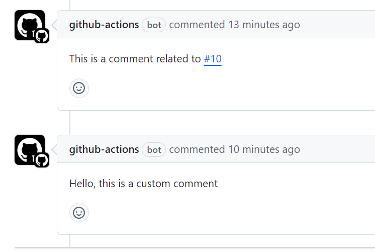

# send-relevant-comment-action-test

It is used to collect links in pr or issues that contain other links that exist on github.



## Usage

Can be used in the following scenarios (but not just this one)

```yml
name: Send Relevant Comment
on:
  pull_request:
    types: [closed]

permissions:
  pull-requests: write
  issues: write

jobs:
  version:
    # if: github.event.pull_request.merged == true
    timeout-minutes: 15
    runs-on: ubuntu-latest
    steps:
      - name: send relevant comment
        uses: vegetables-school/send-relevant-comment-action@v1
        with:
          github-token: ${{ secrets.GITHUB_TOKEN }}
          custom-comment: 'Hello, this is a custom comment'
```
